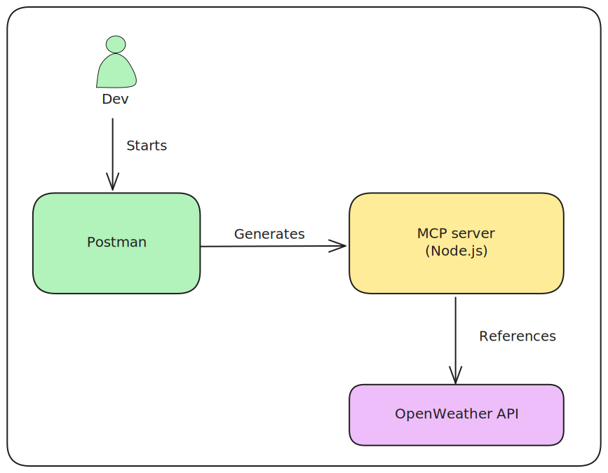
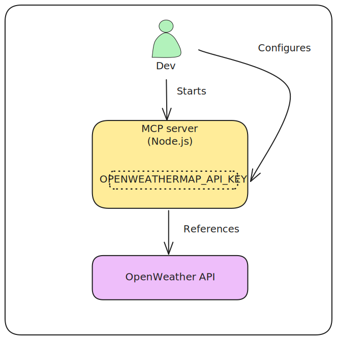
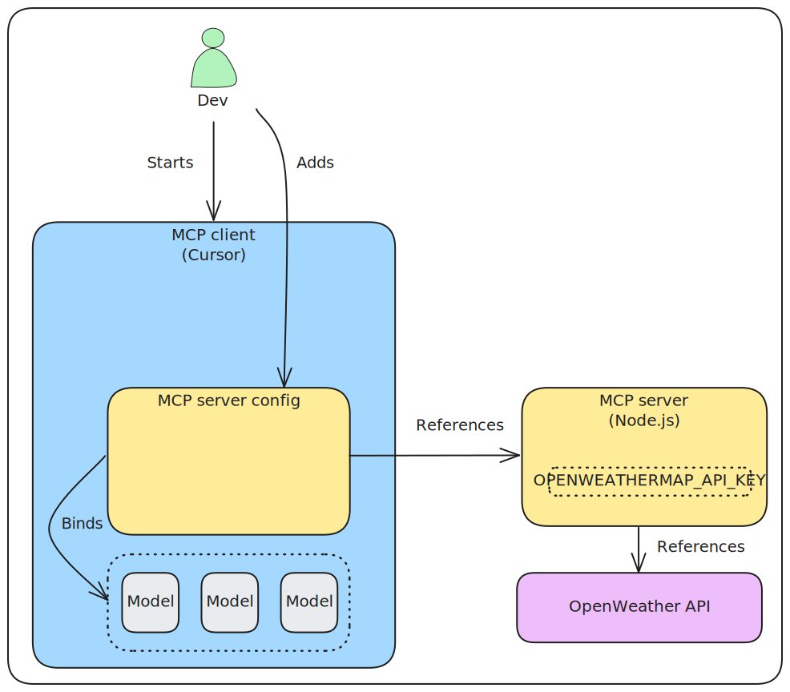
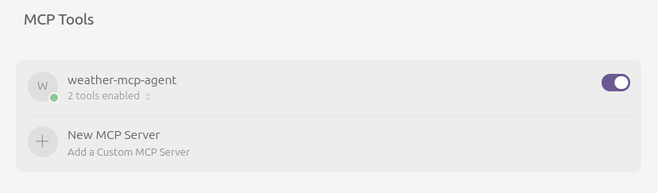
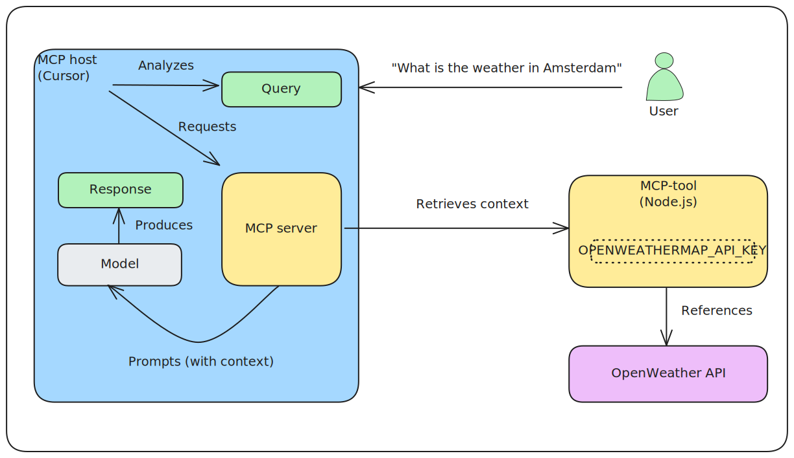
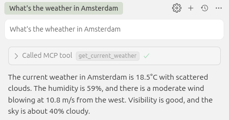

Bring the model context protocol ([MCP](https://modelcontextprotocol.io/introduction)) in action:

- Generate an MCP server (Node.js) from Postman
- Deploy the server locally
- Test the server from a local MCP client (Cursor)

The MCP server in this example connects to the [OpenWeather API](https://openweathermap.org/api).

Actions:

- [Develop](#develop)
  - [Install Postman](#install-postman)
  - [Start Postman](#start-postman)
  - [Generate](#generate)
  - [Build](#build)
- [Deploy (MCP server)](#deploy-mcp-server)
  - [Start](#start)
  - [Configure](#configure)
  - [Restart](#restart)
- [Deploy (MCP client)](#deploy-mcp-client)
  - [Install Cursor](#install-cursor)
  - [Configure Cursor](#configure-cursor)
- [Test](#test)
- [Credits](#credits)

# Develop

Generate an MCP server, using Postman.

See the sections below for a description of the actions taken.




## Install Postman

    sudo snap install postman

## Start Postman

    postman

Login with an account > free plan.

## Generate

In Postman:

- API network > MCP Generator
- Search > Openweathermap (by API Evangelist)
- Select APIs > Add Requests
- Generate
- Download ZIP
- Unzip

The API requests in this example serve as the "tools" that an LLM can use.

## Build

In the ./src directory:

    npm install

# Deploy (MCP server)

Start the MCP server and configure it with an API key to access the underlying API.

See the sections below for a description of the actions taken.



## Start

In the ./src directory:

    node mcpServer.js

## Configure

In this example, we use the OpenWeather API.

In OpenWeather:

- Create an account or sign-in
- Save the API key
- https://openweathermap.org/api

Copy the API key into src/.env (not checked in in this repo):

- OPENWEATHERMAP_API_KEY=your_copied_key

## Restart

In the ./src directory:

    node mcpServer.js

# Deploy (MCP client)

Install and configure Cursor as an MCP client that embeds the above deployed MCP server into its models.

In this example, no specific model binding is selected (we just use the Cursor defaults).

See the sections below for a description of the actions taken.



## Install Cursor

Install:

- https://www.cursor.com/

Observe preconfigured models:

- Cursor settings > Models

## Configure Cursor

Add the running MCP server to Cursor.

- In Cursor, select Cursor Settings > MCP tools > New MCP Server
- Add args: "your-parent-dirs/mcpServer.js"
  ```
  {
    "mcpServers": {
      "weather-mcp-agent": {
        "command": "node",
        "args": ["your-parent-dirs/mcp-nodejs/src/mcpServer.js"]
      }
    }
  }
  ```

Observe a green dot, indicating that the MCP-server is ready to use.



Sometimes it seems additionally selecting the disable/enable switch is required.

# Test

Ask a question to the models:

- Ctrl-I > "What's the weather in Amsterdam" > Accept



Based on the question, the LLM internally reasons and decides which tool to use in order to produce an answer.



# Credits

This example is based on:

https://javascript.plainenglish.io/i-stopped-building-frontends-now-i-use-mcp-servers-to-let-ai-run-my-apps-178b0d7107ca
